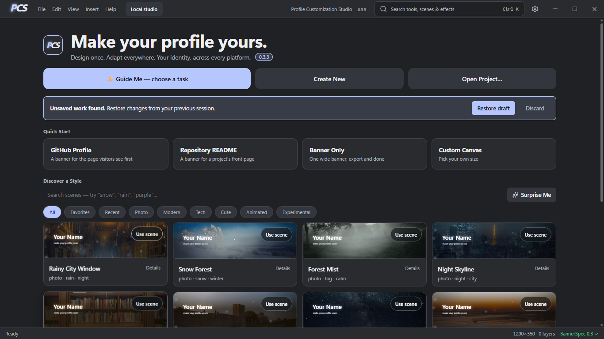
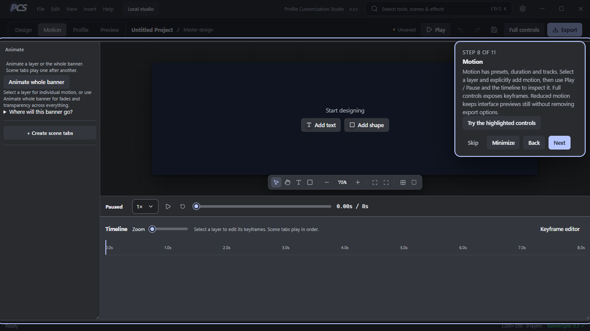

# Profile Customization Studio

Design your online identity, preview it across platforms, and export the right version.

PCS is a free, local-first Windows desktop design tool. **Version 0.3.3.** See the [0.3.3 release notes](docs/release-notes-0.3.3.md) for changes and limits.



## Download and start

**[Download PCS 0.3.3 for Windows x64](https://github.com/amgedi/Profile-Customization-Studio/releases/download/v0.3.3/PCS-0.3.3-Windows-x64.zip)**. Extract the whole folder, then open **Profile Customization Studio.exe**. Windows 10/11 and Microsoft Edge WebView2 Runtime are required. Keep the license and notice files with the app. No developer tools are needed for this download. The public app package contains only Studio and its notices; the Launcher is maintained for local development only.

On first launch, choose **Start tutorial** or **Skip — I know my way around**. The tutorial follows the real controls and lets you try them, with Back, Next, Skip and Finish. Restart from Help or Settings → Interface & startup. **Guide Me** offers task guidance alongside the editor. See [the tutorial guide](docs/tutorial.md).

## What you can do

- Open a PCS project, import your own artwork, or apply a licensed photo scene.
- Change banner backgrounds directly, edit text/fonts, arrange layers, and add effects or motion.
- Preview profile layouts and target crops while keeping your master design.
- Compose GitHub README sections with optional public account data, repositories, badges and statistics.
- Keep reusable local assets, Identity Kits, history and design variants.
- Insert real buttons and searchable icons, and customize profile alignment, widths and spacing.
- Customize Studio themes and backgrounds, with accessible upload zones and readable surface options.
- Follow contextual Guide Me routes or restart the thirteen-step tutorial from Help/Settings.
- Save editable PCS projects and use Export Studio for PNG, JPEG, WebP, SVG, composited GIF, runtime-supported WebM/MP4 or a GitHub profile package with attribution.
- Repeated exports preserve previous files with numbered companion names.



PCS is independent and is not affiliated with the previewed platforms. Names belong to their respective owners.

## Support

PCS is free and open source. Optional support helps fund development, testing, documentation, accessibility, and long-term maintenance. Every feature remains free. Support appears in the welcome, Home, About and Settings; you can skip immediately.

[GitHub Sponsors](https://github.com/sponsors/amgedi) · [Ko-fi](https://ko-fi.com/openfhs) · [Buy Me a Coffee](https://buymeacoffee.com/openfhs)

## Run from source

Install Node.js 22.12+, npm 10+, stable Rust MSVC, Microsoft C++ Build Tools and WebView2. See [source setup](docs/getting-started.md).

```powershell
npm ci
npm run typecheck
npm test
npm run tauri -w @pcs/studio -- dev
```

For a browser preview use npm run dev -w @pcs/studio; desktop dialogs and secure credentials need the native app. Build Studio with npm run build followed by cargo build --release --locked -p pcs-studio. Public packaging uses [scripts/package-public.mjs](scripts/package-public.mjs), which never calls the local development staging script.

## Privacy and limits

Projects stay on your computer. Optional GitHub actions use HTTPS APIs and the native OS keyring. Remote avatars, custom URLs and badges can make network requests. There is no analytics SDK or telemetry endpoint in the audited first-party source. See [privacy](docs/privacy.md).

Platform previews are guides; verify placement on the destination. Composited GIF export is available; WebM/MP4 depend on runtime codec support. Imported GIF backgrounds are sampled by timestamp during compositing; frame editing is not provided. Video is silent and flattened. Some platforms disable SVG motion. Export Studio shows target notices. macOS/Linux builds are unverified. The portable Windows executable is unsigned; Windows may show a publisher warning. Development tools have documented advisories; see [dependency policy](docs/dependencies.md).

## License and contributions

PCS source is **AGPL-3.0-only**; see [LICENSE](LICENSE). Third-party works keep their licenses, including attribution/share-alike requirements. See [THIRD_PARTY_NOTICES](THIRD_PARTY_NOTICES.md) and [asset policy](docs/assets-and-licenses.md). Distribution includes full production Node and Windows main-app native dependency license texts and corresponding source.

See [CONTRIBUTING](CONTRIBUTING.md), [SECURITY](SECURITY.md), [release preparation](docs/releasing.md) and [CHANGELOG](CHANGELOG.md).
