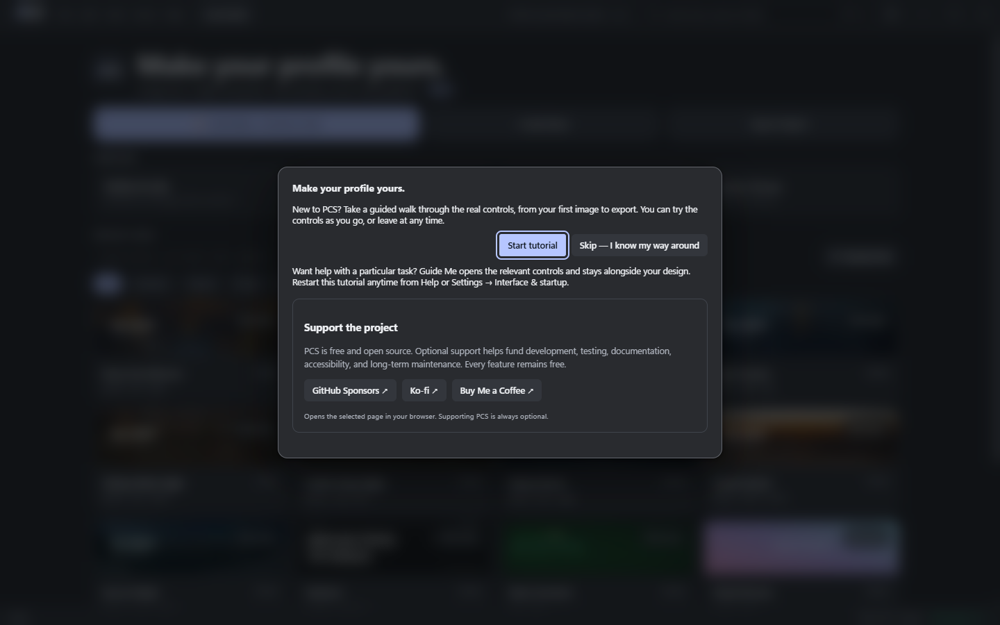
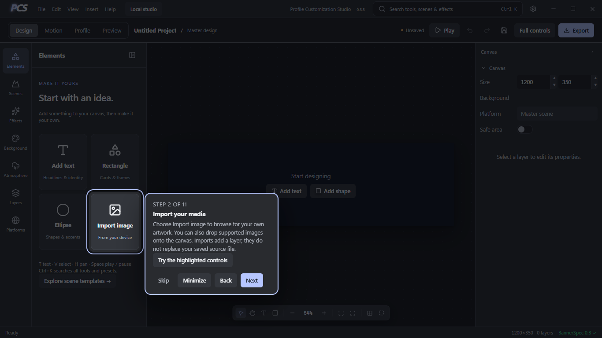

# Your first PCS design

The first-run welcome offers Start tutorial and an immediate expert Skip. Support is optional and every feature remains free. Completion and skipping persist in native app-data (browser preview uses local storage). Restart from Help → Restart startup tutorial or Settings → Interface & startup.

The existing spotlight tour follows thirteen steps:

1. Home: Open Project, Create New or Guide Me. Use a single click or Enter.
2. Design → Elements → Import image: choose local artwork or drop supported images on the canvas.
3. Scenes: click a scene to apply it, confirming replacement of existing artwork. Details opens information and a Use Scene action. Browsing does not change history.
4. Background: change colour, gradient and banner shape directly. Replace a photo by explicitly importing and arranging a new image. Profile has Change / edit banner.
5. Elements → Add text; select text and edit Text & Font in the inspector. Edit its content field directly; double-click is optional.
6. Layers: select, expand groups, hide/lock, reorder top-level rows and use F2 to rename.
7. Effects: choose selected layer or whole scene, preview then explicitly Add; inspect its stack.
8. Motion: add presets explicitly, adjust duration/tracks and inspect with Play/Pause. Full controls offers keyframes.
9. Profile: choose a platform; GitHub supports optional public username data, About, tech stack, repositories and other sections.
10. Profile → + Button: add a label and URL, then choose fill/outline, icon, size, corners and alignment.
11. Profile → + Icon: choose a graphic from the visual picker and adjust its colour, size and optional label.
12. Preview: inspect composition and safe areas. Check target adaptation in Profile/Export Studio.
13. Save project preserves editable work. Export selects target/format, previews crop and saves files. Upload GitHub packages yourself.

Back/Next/Skip/Finish are keyboard focusable. Arrow keys navigate while the tutorial card has focus; Escape skips immediately. Try the highlighted controls minimizes the card and moves focus to the actual control; Show instructions brings the guidance back. Tab reaches the real interface because the tour is interactive. You can open native import/export dialogs while learning. Reduced motion disables tutorial animation.

Walking the tour changes navigation/selection only. It does not insert samples, apply presets, publish, export, or add history automatically. Edits you explicitly make are your real project edits. Leaving restores your previous workspace, panel visibility and selection while retaining your edits. Guide Me provides optional task guidance alongside the editor. The startup walkthrough remains the existing spotlight tutorial, with one saved completion state.

